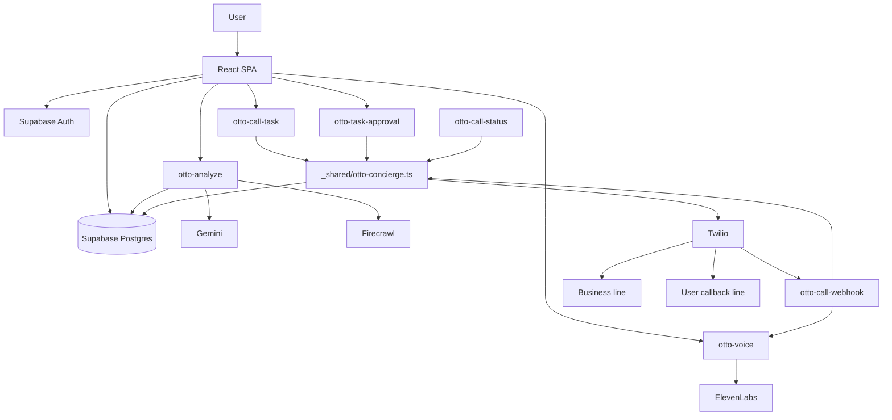

# Otto
Otto is a mobile-first AI concierge that turns uncertain real-world tasks into verified outcomes.

Instead of stopping at "here are some links," Otto can research the live web, decide when a phone call is actually the better tool, place that call from the cloud, and call the user back with a spoken summary.

At the center of that experience are two systems:

- `Firecrawl` for live retrieval, evidence gathering, and source-backed actionability
- `ElevenLabs` for Otto's voice across the app, the business call, and the callback briefing

<p align="center">
  
</p>

## Why We Built It

Most assistants are still weak at one of two things:

- they can talk, but they cannot verify
- they can retrieve links, but they cannot finish the job

Real users do not just want information. They want outcomes:

- "Can you check if this place is open?"
- "Can you verify whether they have vegetarian options?"
- "Can you make sure a reservation is actually available?"
- "Can you tell me what I'm looking at and help me decide what to do next?"

Otto was built for that gap.

It combines:

- fast conversational orchestration
- live web research
- vision input from the camera
- voice output that sounds consistent and human
- cloud phone calls when verification matters more than another web answer

The result is an assistant that can move from question to confirmation.

## What Otto Does

Otto is designed around a simple progression:

1. Understand the user's intent
2. Decide whether the answer needs live web evidence
3. Use Firecrawl if current external information matters
4. Use Gemini to synthesize the best next step
5. If the task needs real-world verification, place a phone call
6. Use ElevenLabs to speak as Otto
7. Call the user back with the result

In practice, Otto can:

- answer lightweight conversational questions instantly
- use the camera to understand what the user is looking at
- research current places, products, hours, menus, reviews, and availability
- surface sources in a cleaner, richer card layout
- propose live verification or booking calls
- place those calls through the cloud
- brief the user afterward with a voice callback

## Why Firecrawl Matters

Firecrawl is not a side integration in Otto. It is the live retrieval layer that makes the product trustworthy.

Otto uses Firecrawl when freshness and external grounding matter. That includes:

- business discovery
- websites and phone numbers
- current location-based information
- booking and reservation context
- details that should be verifiable instead of guessed

Firecrawl gives Otto:

- real web results
- page content that Gemini can reason over
- source URLs and snippets for the user interface
- evidence that can be attached to live call proposals

That means Otto is not pretending to know the world from memory. It can go out, check, and come back with evidence.

### Why this matters for hackathon judging

From a hackathon perspective, Firecrawl is what allows Otto to move beyond a generic chat app:

- it grounds answers in live data
- it enables agentic decision-making with evidence
- it supports both product discovery and real-world task execution
- it gives the user transparent sources rather than opaque output

## Why ElevenLabs Matters

ElevenLabs is the voice identity of Otto.

A lot of demos use one voice system in-app and a completely different speech path once telephony starts. Otto does not. The same voice layer powers:

- spoken replies in the app
- voice prompts during business calls
- spoken callback briefings to the user

That matters because Otto is not only a chat interface. It is a voice-present agent.

ElevenLabs gives Otto:

- more natural voice quality than default browser speech
- a consistent brand voice across channels
- reusable speech generation for app, call, and callback modes
- a much stronger end-to-end feeling of "one assistant" instead of stitched-together tooling

### Why this matters for hackathon judging

From a demo and product perspective, ElevenLabs is what makes Otto feel alive:

- the experience is more memorable
- the callback flow feels premium instead of robotic
- voice becomes part of the product, not just a fallback feature

## Core Product Loop

### 1. Fast conversational turns

When the user says something lightweight like:

- `hi`
- `hello`
- `thanks`
- `okay`

Otto does not unnecessarily trigger retrieval. Gemini handles those turns directly so the product feels fast and natural.

### 2. Retrieval-backed answers

When the user asks something current, local, or verifiable, Otto escalates to Firecrawl and returns:

- a synthesized answer
- source-backed context
- structured follow-ups
- optional action links
- optional call proposals when the web is not enough

### 3. Cloud call execution

When verification matters more than another web answer, Otto can:

- create a call task
- speak to the target business
- gather the answer
- summarize the result
- call the user back with a spoken briefing

## Example Use Cases

Otto was designed for tasks that sit between search and action.

### Hospitality and reservations

- check if a restaurant can seat 4 people tomorrow at 5 PM
- verify whether vegetarian-only options are available
- confirm opening hours before the user travels

### Local decision-making

- compare nearby options with ratings and quick source review
- understand whether somewhere is worth visiting right now
- get direction-oriented context from sourced results

### Product and shopping discovery

- surface multiple options cleanly from sourced results
- show images and useful metadata when available
- send the user directly to inspect or buy

### Camera-assisted research

- the user points the phone at an object, sign, menu, storefront, or place
- Gemini interprets the scene
- Firecrawl handles the live evidence layer if more context is needed

## Architecture



## System Roles

- `Gemini` is the orchestration layer: intent interpretation, answer synthesis, and decision-making
- `Firecrawl` is the live retrieval and evidence layer
- `ElevenLabs` is the voice layer
- `Twilio` is the telephony bridge
- `Supabase` is the app backend for auth, profiles, tasks, approvals, and edge functions

That separation is intentional. It keeps Otto from becoming a vague "AI does everything" demo. Each system has a clear job.

## Request Lifecycle

### In-app answer

1. The user sends text, voice, or an image-backed query.
2. The frontend calls `otto-analyze`.
3. Gemini interprets the turn and decides whether Firecrawl is needed.
4. Firecrawl runs only when live external information matters.
5. Gemini synthesizes the answer using session context, profile context, vision context, and sourced evidence.
6. The UI renders the answer, rich source cards, follow-ups, and any call proposal.
7. `otto-voice` generates the ElevenLabs voice reply.

### Cloud-call flow

1. The user approves a live call proposal.
2. `otto-call-task` creates the task and ordered steps.
3. `_shared/otto-concierge.ts` executes the task chain.
4. Twilio places the business call.
5. `otto-call-webhook` serves TwiML and advances the conversation.
6. Gemini interprets the business response.
7. Otto stores the result and final summary.
8. Otto calls the user back with an ElevenLabs-generated spoken briefing.

## Key Functions

### `otto-analyze`

Purpose:

- authenticated turn handling
- Gemini orchestration
- Firecrawl retrieval and source normalization
- call proposal generation

Path:

- [`supabase/functions/otto-analyze/index.ts`](./supabase/functions/otto-analyze/index.ts)

### `otto-voice`

Purpose:

- ElevenLabs voice generation for app, call, and callback modes

Path:

- [`supabase/functions/otto-voice/index.ts`](./supabase/functions/otto-voice/index.ts)

### `otto-call-task`

Purpose:

- create and start live call tasks

Path:

- [`supabase/functions/otto-call-task/index.ts`](./supabase/functions/otto-call-task/index.ts)

### `otto-call-webhook`

Purpose:

- process Twilio webhooks
- play voice prompts
- gather speech
- progress the live call flow

Path:

- [`supabase/functions/otto-call-webhook/index.ts`](./supabase/functions/otto-call-webhook/index.ts)

### Shared runtime

Path:

- [`supabase/functions/_shared/otto-concierge.ts`](./supabase/functions/_shared/otto-concierge.ts)

This is the call engine that coordinates tasks, steps, call state, and callbacks.

## Frontend Highlights

### Otto chat experience

- mobile-first chat UI
- voice replies
- camera capture and image attachment flow
- expandable answer details
- richer source cards with thumbnails and metadata when available

Main screen:

- [`src/features/otto/screens/OttoPage.tsx`](./src/features/otto/screens/OttoPage.tsx)

### Voice

- [`src/features/otto/api/fetchOttoVoice.ts`](./src/features/otto/api/fetchOttoVoice.ts)

### Source-card presentation

- [`src/features/otto/components/SourceCard.tsx`](./src/features/otto/components/SourceCard.tsx)

## Tech Stack

- `React`
- `TypeScript`
- `Vite`
- `Supabase`
- `Gemini`
- `Firecrawl`
- `ElevenLabs`
- `Twilio`
- `Framer Motion`

## Environment

### Frontend

- `VITE_SUPABASE_URL`
- `VITE_SUPABASE_PUBLISHABLE_KEY`

### Supabase function secrets

- `SUPABASE_URL`
- `SUPABASE_ANON_KEY`
- `SUPABASE_SERVICE_ROLE_KEY`
- `GEMINI_API_KEY`
- `GEMINI_MODEL`
- `FIRECRAWL_API_KEY`
- `ELEVENLABS_API_KEY`
- `ELEVENLABS_MODEL_ID`
- `ELEVENLABS_APP_VOICE_ID`
- `ELEVENLABS_CALL_VOICE_ID`
- `ELEVENLABS_CALLBACK_VOICE_ID`
- `TWILIO_ACCOUNT_SID`
- `TWILIO_AUTH_TOKEN`
- `TWILIO_PHONE_NUMBER`
- `OTTO_WEBHOOK_SECRET`
- `OTTO_CALLBACK_DELAY_MS`

## Local Development

Install:

```bash
npm install
```

Run:

```bash
npm run dev
```

Type-check:

```bash
npx tsc --noEmit -p tsconfig.app.json
npx tsc --noEmit -p tsconfig.node.json
```

## Why Otto Stands Out

Otto is not just a chatbot, not just a voice wrapper, and not just a call bot.

Its value is the combination:

- Firecrawl makes it current
- Gemini makes it intelligent
- ElevenLabs makes it feel real
- Twilio makes it actionable
- Supabase makes it durable

That combination is what turns a hackathon demo into a believable product direction.
