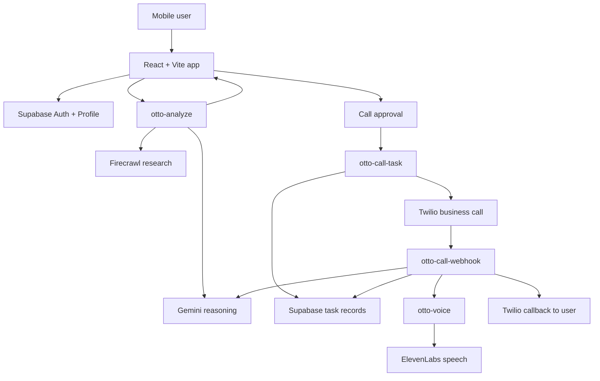

# Otto: AI for Your Physical World

Otto is a mobile-first AI concierge built for questions that live in the real world.

Instead of acting like a chat box that only summarizes links, Otto is designed to understand what the user is looking at, research the surrounding context, compare options, find prices, surface cheaper alternatives, and only escalate to a phone call when a real conversation is actually the right tool.


<p align="center">
  
</p>

## Why Otto Exists

Most assistants are good at summarizing the internet and weak at connecting that information back to the real world around the user.

Otto is designed for questions like:

- What is this product I am pointing at?
- How much does it cost here, and can I get it cheaper nearby or online?
- What am I looking at on this menu, shelf, sign, or storefront?
- What are the closest good options around me right now?
- Is the restaurant actually taking reservations tonight?
- Does the hotel still have availability if I need Otto to verify it live?

That is the gap Otto is built to close.

## What the Product Does

Otto combines four different behaviors in one product:

1. **Understand the user request**
   Otto accepts text, voice dictation, and image input.
2. **Research live information**
   It uses Gemini for reasoning and Firecrawl for web evidence, including nearby options, product information, and current business details.
3. **Take action when needed**
   Otto can stay in chat, speak the answer aloud, or create a cloud call task if the user explicitly asks it to call.
4. **Return a grounded result**
   Otto stores summaries, approvals, transcripts, and runtime events in Supabase so the system behaves like a real assistant instead of a one-shot demo.

## Core User Experience

From the user's perspective, the product feels like this:

```text
Point, ask, or speak -> Otto understands the scene
                         |
                         v
            Otto researches and compares options
                         |
              -----------------------------
              |                           |
              v                           v
      Otto answers in chat         User asks Otto to call
                                          |
                                          v
                           Otto calls business and reports back
```

Typical use cases:

- identify a product, object, sign, menu item, or storefront from the camera
- find prices for a product the user is looking at
- compare cheaper nearby or online alternatives
- answer place-based questions about restaurants, cafes, hotels, and shops
- verify bookings, reservations, or availability when a live call is necessary
- handle tasks where a business may respond with new information on the phone

## How Otto Works

### 1. In-app answer flow

The frontend is a mobile-first React app where the user can type, speak, or attach an image. Otto interprets the request, decides whether live retrieval is needed, gathers evidence, and returns a grounded answer with sources.

This is the main product loop. In many cases, Otto never needs to call anyone. It can already do useful work by combining camera input, session context, and live web retrieval to explain what the user is seeing, find related products, look up prices, and compare options nearby.

The key point is that Otto does not always jump to a call. The current logic only offers a business call when the user explicitly asks for one by using the word `call`.

### 2. Cloud call flow

If the user wants Otto to call, the app creates a structured task and hands execution to Supabase edge functions. Twilio places the business call, Gemini plans the next conversational turn, and Otto asks one small question at a time until the task is resolved.

Otto is designed to stay grounded during the call:

- it does not read internal instructions aloud
- it does not dump the full checklist in one turn
- it answers follow-up questions only from known user or task context
- it avoids hallucinating unknown details
- it stores call runtime events for debugging when something fails

## Architecture



## Example Experiences

Otto is strongest when the user is in motion and needs an answer tied to the physical world around them.

Examples:

- Point the camera at a product and ask:
  `What is this, how much does it usually cost, and are there cheaper alternatives nearby or online?`
- Point the camera at a menu and ask:
  `What are the vegetarian options here, and what would you recommend?`
- Ask a local discovery question:
  `Find the nearest vegetarian restaurants and tell me which one looks best.`
- Escalate to a real-world action when needed:
  `Can you call and check whether they can seat 3 people tomorrow at 7?`

## Main System Pieces

### Frontend

The app shell lives in `src/app/App.tsx`, and the main Otto experience lives in `src/features/otto/screens/OttoPage.tsx`.

Recent product-facing improvements include:

- cleaner mobile chat layout
- dots-only thinking state
- improved mobile speech dictation handling
- better spoken formatting for times, AM/PM, and money values
- one-time mobile install prompt for home-screen demos
- otter-branded PWA icons and manifest assets

### Supabase edge functions

The backend behavior is split into clear functions:

- `supabase/functions/otto-analyze`
  Interprets a user turn, chooses research, synthesizes an answer, and optionally returns a call proposal.
- `supabase/functions/otto-call-task`
  Creates the cloud call task and starts the business-call workflow.
- `supabase/functions/otto-call-webhook`
  Runs the live business conversation, stores the transcript, tracks facts learned during the call, and handles close-path logic.
- `supabase/functions/otto-voice`
  Generates spoken audio for Otto in the app, on the business call, and on the callback.
- `supabase/functions/_shared/otto-concierge.ts`
  Holds shared orchestration, task helpers, and runtime logging utilities.

### Data layer

Supabase stores:

- user auth and profile context
- call tasks and task steps
- approval state
- conversation logs
- result summaries
- call runtime diagnostics

This is what allows Otto to behave like a real product instead of a one-off demo script.

## Demo Narrative for Judges

If you are demoing Otto live, the strongest flow is to show both sides of the product:

1. Start with a camera-led or physical-world question such as:
   `What is this product, how much does it cost, and are there cheaper alternatives nearby?`
2. Show that Otto can reason over the image, research the web, and return grounded results with sources.
3. Move into local discovery with something like:
   `What are the nearest vegetarian restaurants?`
4. Then show action by escalating into:
   `Can you call and check whether they can seat 3 people tomorrow at 7?`
5. Approve the call.
6. Show the saved task transcript, runtime logs, and callback summary.

That sequence demonstrates the full point of the product:

- perception
- retrieval
- comparison
- reasoning
- action
- verification

## Example Camera-Led Request

```text
What is this item, how much does it cost, and can you find cheaper alternatives nearby or online?
```

Otto can use the image, session context, and live research to turn a photo into a practical answer.

## Example Call-Oriented Request

```text
Can you call Timeless Cafe and check if they can seat 3 people tomorrow at 7 PM,
whether they have vegetarian options, and whether this number should be used for the booking?
```

Otto will convert that request into a cloud task, place the call, handle the business response incrementally, and save the result in the task history.

## Mobile App Experience

Otto can be installed to the home screen as a mobile web app.

- On Android, the app uses a one-time install prompt and can trigger the native install flow.
- On iPhone Safari, Otto shows one-time "Add to Home Screen" guidance instead.
- Once installed or dismissed, the prompt stays out of the way.

This matters for demos because the product presents more like a dedicated mobile app than a browser tab.

## Tech Stack

- **Frontend:** React, TypeScript, Vite, Framer Motion
- **Backend:** Supabase Auth, Database, Edge Functions
- **Reasoning:** Gemini
- **Research:** Firecrawl
- **Voice:** ElevenLabs
- **Telephony:** Twilio

## Local Development

Install dependencies:

```bash
npm install
```

Run the app:

```bash
npm run dev
```

Run checks:

```bash
npm test
npm run lint
npm run build
```

## Environment Variables

Frontend:

- `VITE_SUPABASE_URL`
- `VITE_SUPABASE_PUBLISHABLE_KEY`

Supabase function secrets:

- `SUPABASE_URL`
- `SUPABASE_ANON_KEY`
- `SUPABASE_SERVICE_ROLE_KEY`
- `GEMINI_API_KEY`
- `GEMINI_MODEL`
- `FIRECRAWL_API_KEY`
- `ELEVENLABS_API_KEY`
- `ELEVENLABS_MODEL_ID`
- `ELEVENLABS_APP_VOICE_ID`
- `ELEVENLABS_CALL_VOICE_ID`
- `ELEVENLABS_CALLBACK_VOICE_ID`
- `TWILIO_ACCOUNT_SID`
- `TWILIO_AUTH_TOKEN`
- `TWILIO_PHONE_NUMBER`
- `OTTO_WEBHOOK_SECRET`
- `OTTO_CALLBACK_DELAY_MS`

## Deployment Note

The Twilio-facing call functions are designed to validate requests inside the function or through the webhook secret. Because of that, the call-related edge functions should be deployed with `--no-verify-jwt`, otherwise Twilio webhooks can be blocked before Otto's runtime code executes.

## What Makes Otto Different

Otto is not just:

- a chat UI
- a search wrapper
- a camera demo
- a phone bot

It is the combination that matters.

Otto can understand a real-world question, use the camera when helpful, pull in live evidence, compare options, decide when human-facing verification is necessary, make the call when asked, handle the conversation safely, and return a usable result back to the person who asked.

That is the core product story.
