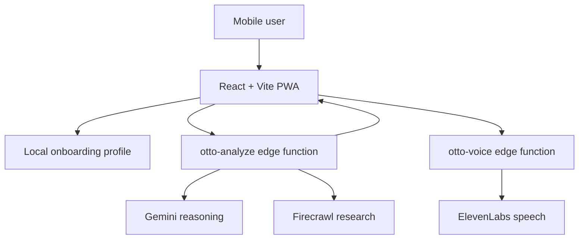

# Otto: AI for Your Physical World

<p align="center">
  
</p>

Otto is a mobile-first AI assistant for questions that begin in front of you, not in a browser tab.

You can point the camera at a product, book, menu, sign, storefront, or place and ask practical questions such as what it is, what it costs, whether there are cheaper alternatives, whether it is worth buying, or what to do next. Otto combines image understanding, live web research, spoken replies, and lightweight session memory into one mobile experience.

This repo is set up for demo speed. There is no login wall. The onboarding flow collects local context such as home location, current region, language, timezone, and travel mode, then stores that profile in the browser so Otto can use it in answers without slowing the experience down.

## What Otto Actually Does

Otto is designed around a simple loop:

1. See what the user is asking about.
2. Understand the situation and the decision they are trying to make.
3. Pull in live web evidence when the answer depends on fresh information.
4. Return a grounded answer with useful sources and optional voice playback.

That makes Otto useful for more than one narrow demo. It works well across:

- product recognition and price checks
- cheaper alternatives nearby or online
- book discovery and recommendation-style questions
- menu understanding and dietary checks
- nearby place discovery
- quick comparisons between real-world options

Example prompts:

- `What is this product and what should I expect to pay for it?`
- `Find cheaper alternatives nearby or online.`
- `Tell me more about this book and why I should read it.`
- `What are the vegetarian options on this menu?`
- `What is this place, and is it worth going to?`
- `Find the nearest vegetarian restaurants.`

## Why This Project Matters

Most AI products are strongest when the input is already text and the user already knows what to search for. Otto is aimed at the opposite case: moments where the user is standing in front of something in the physical world and wants help understanding it quickly.

That changes the product shape. Otto is not just a chatbot and it is not just a camera demo. The useful part is the handoff between perception, research, comparison, and decision support.

## Product Experience

```text
User points, types, or speaks
          |
          v
Otto interprets the scene or request
          |
          v
Otto researches the web when needed
          |
          v
Otto compares options and explains the result
          |
          v
Otto can read the answer aloud in the app
```

From the user perspective, the product is intentionally simple:

- ask by text, voice, or camera
- get one clear answer back
- expand sources or context only when needed
- hear the answer out loud if that is more convenient

The UI is tuned for mobile demoing. Otto supports install-to-home-screen, compact source panels, live voice dictation, and spoken answer playback without requiring any account setup.

## Demo Story for Judges

If you want the cleanest hackathon demo, show Otto across three different question types:

1. Camera understanding  
   `What is this item?`

2. Practical decision support  
   `How much does it usually cost, and are there cheaper alternatives nearby or online?`

3. Rich follow-up on a physical object  
   `Tell me more about this book and why I should read it.`

That sequence makes the product legible very quickly:

- Otto can see
- Otto can research
- Otto can compare
- Otto can help the user decide

## Architecture



### Frontend

The app shell lives in `src/app/App.tsx`.

The main Otto experience lives in `src/features/otto/screens/OttoPage.tsx`, with the surrounding pieces split into focused components and hooks:

- camera capture
- speech recognition
- compact source cards
- answer playback
- install prompt
- local profile management

### Edge functions

The backend is intentionally small and focused:

- `supabase/functions/otto-analyze`
  Handles interpretation, Gemini prompting, optional Firecrawl research, and grounded answer synthesis.
- `supabase/functions/otto-voice`
  Converts Otto responses into in-app speech using ElevenLabs, with speech formatting normalized for time and currency.

### Data model

Otto no longer depends on user auth or a remote profile table for the core experience.

- user profile defaults are stored locally in the browser
- active conversation context is stored in memory during the session
- Supabase is used for edge functions and secrets

That keeps the demo fast and reduces operational drag during judging.

## Codebase Layout

```text
src/
  app/                 app shell and navigation
  features/account/    local profile and settings
  features/install/    one-time mobile install prompt
  features/onboarding/ onboarding flow
  features/otto/       chat, camera, dictation, sources, playback
  shared/              speech helpers and Supabase client setup

supabase/
  functions/
    otto-analyze/      reasoning + research pipeline
    otto-voice/        speech synthesis pipeline
```

## Mobile App Behavior

Otto is installable as a PWA:

- Android browsers can trigger the native install flow
- iPhone Safari shows a one-time Add to Home Screen prompt
- the prompt appears once and stays out of the way after dismissal or install

That makes the experience feel much closer to a real mobile app than a normal browser page, which matters in a short demo.

## Local Development

Install dependencies:

```bash
npm install
```

Run the app:

```bash
npm run dev
```

Run checks:

```bash
npm test
npm run lint
npm run build
```

## Environment Variables

Create a local `.env` from `.env.example`.

Frontend:

- `VITE_SUPABASE_URL`
- `VITE_SUPABASE_PUBLISHABLE_KEY`

Supabase function secrets:

- `SUPABASE_URL`
- `SUPABASE_ANON_KEY`
- `GEMINI_API_KEY`
- `GEMINI_MODEL`
- `FIRECRAWL_API_KEY`
- `ELEVENLABS_API_KEY`
- `ELEVENLABS_MODEL_ID`
- `ELEVENLABS_APP_VOICE_ID`

## What Makes Otto Different

Otto is not trying to be a general-purpose assistant for everything. It is designed for practical questions tied to the physical world around the user.

The combination matters:

- camera input for context
- live research for freshness
- comparison for decision quality
- spoken output for usability on the move

That is the core of the product, and it is the lens that should be used to judge the project.
