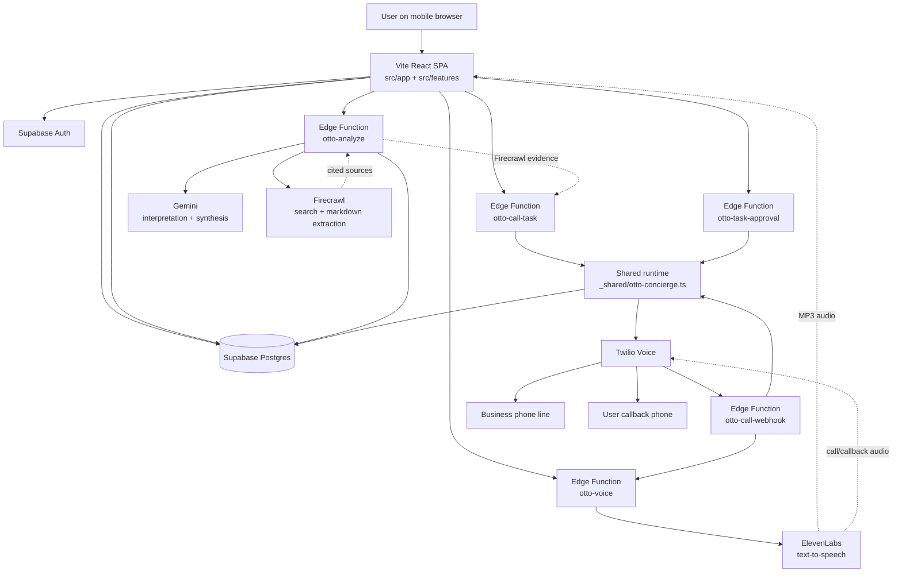

# Otto AI Navigator

Otto is a mobile-first AI assistant for live visual help, Firecrawl-backed web verification, and cloud-run phone workflows. A user can point the camera at something, type or speak a question, get a researched answer, approve a phone call if verification is needed, and then leave the app while Otto finishes the business call and calls the user back with a spoken summary.

This codebase is structured around one core principle: Firecrawl is the retrieval system and ElevenLabs is the voice system. Gemini handles interpretation and synthesis, but Firecrawl supplies the evidence and ElevenLabs supplies the spoken audio across both the app and the phone workflow.

## What Otto Does

- Accepts text, voice, and optional camera input from the user.
- Uses Gemini to interpret the request and decide whether fresh external information is needed.
- Uses Firecrawl as the only retrieval layer for web research, source collection, and call-target evidence.
- Produces a structured assistant reply with sources, follow-ups, and optionally a call proposal.
- Lets the user approve a cloud-run call workflow.
- Uses Twilio to place the call and route webhook events.
- Uses ElevenLabs to generate the spoken audio for in-app playback, business-call prompts, and callback briefings.
- Stores task state, approvals, source snapshots, and conversation logs in Supabase.

## Architecture



## Main Runtime Surfaces

### Frontend app

The frontend is a Vite + React single-page app. It handles authentication, onboarding, the Otto conversation UI, the task inbox, and account management.

Key areas:

- `src/app`: app shell, session bootstrap, tab navigation, auth/onboarding gates
- `src/features/otto`: main Otto experience, camera flow, voice playback, session memory, call approval UI
- `src/features/tasks`: task inbox, approval actions, task timeline, Firecrawl evidence display
- `src/features/account`: profile persistence, especially callback-phone capture
- `src/shared/supabase`: browser Supabase client and generated DB types

### Supabase project

The repo is wired to a Supabase project via `supabase/config.toml` with project id `hwtqyyijkxznnjclushg`.

Supabase is used for:

- Auth and session validation
- Edge Functions
- Postgres storage for profiles, tasks, steps, approvals, and logs
- RLS-protected reads from the client

### Deployed Edge Functions

These functions are the deployed backend runtime described by the codebase:

- `otto-analyze`: authenticated turn orchestration, Gemini interpretation, Firecrawl research, reply synthesis, call proposal generation
- `otto-voice`: ElevenLabs text-to-speech for app audio, business-call prompts, and callback briefings
- `otto-call-task`: creates an approved cloud call task, inserts task steps, and starts execution
- `otto-call-webhook`: receives Twilio webhook traffic, manages phone-call turns, and triggers callback playback
- `otto-task-approval`: resolves pending user approvals
- `_shared/otto-concierge.ts`: shared task execution logic, Twilio call creation, callback scripting, status transitions

## Firecrawl-Centered Retrieval Model

Firecrawl is not an optional integration in this product. It is the retrieval and verification layer.

### Where Firecrawl is used

- `supabase/functions/otto-analyze/index.ts`
- `supabase/functions/_shared/otto-concierge.ts`
- frontend task and approval UIs that display stored Firecrawl evidence

### What Firecrawl does in Otto

- Runs web searches against `https://api.firecrawl.dev/v2/search`
- Pulls markdown-backed page content for synthesis
- Supplies business contact evidence for call proposals
- Populates the source list shown in the assistant drawer
- Populates `firecrawlEvidence` in call proposals
- Populates `source_snapshot` on persisted task records

### Firecrawl flow

1. The user submits a text or camera-assisted query.
2. `otto-analyze` asks Gemini to interpret the intent and decide whether web retrieval is needed.
3. If retrieval is needed, `otto-analyze` builds one or more Firecrawl queries.
4. Firecrawl returns web results plus markdown content.
5. Otto deduplicates and trims those sources.
6. Gemini uses those Firecrawl results to synthesize the answer.
7. If a live call is appropriate, Otto only proposes one when the phone number looks plausible from Firecrawl-backed evidence.
8. The Firecrawl evidence is stored so the user can review the basis for the call later.

### Important Firecrawl product rule

- Firecrawl is the only search/retrieval layer in this product.
- There is no browser automation layer.
- Google links shown in the UI are convenience actions for the user, not Otto's backend retrieval mechanism.

## ElevenLabs-Centered Voice Model

ElevenLabs is the voice generation layer for every spoken Otto experience.

### Where ElevenLabs is used

- `supabase/functions/otto-voice/index.ts`
- indirectly from `otto-call-webhook` via `otto-voice`
- frontend playback via `src/features/otto/api/fetchOttoVoice.ts`

### Voice modes

The `otto-voice` function supports three voice modes:

- `app`: spoken assistant replies played inside the browser UI
- `call`: spoken prompts played during the outbound business call
- `callback`: spoken summary played during the callback briefing to the user

### ElevenLabs flow

1. The frontend or webhook requests `otto-voice`.
2. `otto-voice` selects the correct voice id based on `app`, `call`, or `callback`.
3. The function calls ElevenLabs streaming TTS.
4. Audio is returned as `audio/mpeg`.
5. The browser plays it directly, or Twilio plays it inside the phone workflow.

### Why ElevenLabs matters here

- It gives Otto one shared TTS layer across app audio and telephony.
- It keeps call prompts and callback summaries in the same backend voice pipeline.
- It avoids duplicating separate speech systems for browser replies and phone flows.

## End-to-End Request Flows

### 1. In-app answer flow

1. User submits text, voice transcript, and optionally a camera frame.
2. Frontend calls `otto-analyze`.
3. `otto-analyze` authenticates the user and loads the stored profile.
4. Gemini interprets the turn.
5. Firecrawl runs if fresh external information is needed.
6. Gemini synthesizes the answer using session context, profile context, and Firecrawl evidence.
7. The frontend shows the answer, sources, structured details, and suggested follow-ups.
8. The frontend requests `otto-voice` and plays the ElevenLabs-generated audio.

### 2. Call proposal flow

1. `otto-analyze` decides a live call would improve the outcome.
2. It returns a `callProposal` with target, summary, questions, and Firecrawl evidence.
3. The user reviews the evidence in the approval sheet.
4. The user approves the task.
5. Frontend calls `otto-call-task`.

### 3. Cloud call and callback flow

1. `otto-call-task` creates an `otto_tasks` record and inserts ordered task steps.
2. `_shared/otto-concierge.ts` starts execution.
3. Twilio places the outbound business call.
4. `otto-call-webhook` handles intro, gather, status, and callback phases.
5. Business-call prompts are spoken through ElevenLabs audio generated by `otto-voice`.
6. Gemini evaluates the call transcript turn by turn and decides whether to continue, complete, or fail.
7. Task results are written back to Supabase.
8. Twilio places the callback to the user's saved phone number.
9. The callback speech is generated through ElevenLabs and played back to the user.

## Data Model

The migrations define a compact cloud-task schema.

### `profiles`

Stores user defaults and operating context:

- identity and onboarding status
- home/current location
- language, timezone, travel mode
- callback phone

### `otto_tasks`

Stores the parent task record:

- task type, business target, call goal, request query
- status and inbox state
- Firecrawl `source_snapshot`
- conversation log
- Twilio call ids
- latest summary and final result

### `otto_task_steps`

Stores ordered workflow steps. The currently active product only uses:

- `call_business`
- `callback_user`

### `otto_task_approvals`

Stores pending and resolved approvals tied to task steps.

## Repo Map

- `src/app/App.tsx`: session bootstrap, auth/onboarding gating, tab layout
- `src/features/otto/screens/OttoPage.tsx`: main user journey, mic/camera flow, reply playback, task approval trigger
- `src/features/otto/components/SessionDrawer.tsx`: latest answer, sources, follow-ups, and actions
- `src/features/otto/components/CallApprovalSheet.tsx`: Firecrawl-backed call review UI
- `src/features/tasks/components/TaskHistoryPanel.tsx`: task timeline, evidence view, approval actions
- `supabase/functions/otto-analyze/index.ts`: core reasoning and Firecrawl orchestration
- `supabase/functions/otto-voice/index.ts`: ElevenLabs TTS gateway
- `supabase/functions/otto-call-task/index.ts`: task creation and workflow kickoff
- `supabase/functions/otto-call-webhook/index.ts`: Twilio call control and callback handling
- `supabase/functions/_shared/otto-concierge.ts`: task-chain execution engine
- `supabase/migrations`: schema and workflow evolution

## Environment Variables

### Frontend

- `VITE_SUPABASE_URL`
- `VITE_SUPABASE_PUBLISHABLE_KEY`

### Supabase Edge Function secrets

- `SUPABASE_ANON_KEY`
- `SUPABASE_SERVICE_ROLE_KEY`
- `GEMINI_API_KEY`
- `GEMINI_MODEL` optional, defaults to `gemini-2.5-flash`
- `FIRECRAWL_API_KEY`
- `ELEVENLABS_API_KEY`
- `ELEVENLABS_MODEL_ID` optional, defaults to `eleven_multilingual_v2`
- `ELEVENLABS_APP_VOICE_ID`
- `ELEVENLABS_CALL_VOICE_ID`
- `ELEVENLABS_CALLBACK_VOICE_ID`
- `TWILIO_ACCOUNT_SID`
- `TWILIO_AUTH_TOKEN`
- `TWILIO_PHONE_NUMBER`
- `OTTO_WEBHOOK_SECRET`

### SQL migrations to apply

- `supabase/migrations/202603210001_phase4_cloud_agent.sql`
- `supabase/migrations/202603210002_concierge_inbox_email.sql`
- `supabase/migrations/202603210003_callback_step_phase6.sql`
- `supabase/migrations/202603210004_remove_email_integration.sql`

## Local Development

```bash
npm install
npm run dev
```

## Validation

```bash
npm run build
npm test
npm run lint
```

`deno check` is also worth running against the edge functions if Deno is installed locally.

## Operational Notes

- A callback phone number is required before Otto can start cloud calls.
- The app persists the Firecrawl evidence used to justify a call.
- The callback script tells the user to check the app for the full evidence and call timeline.
- The product currently supports cloud phone workflows, not email workflows.
- Existing code explicitly enforces that Firecrawl is the retrieval layer and ElevenLabs is the voice layer.
