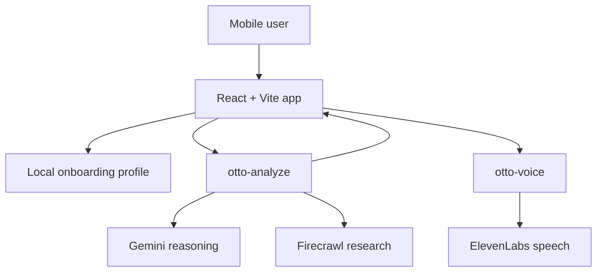

# Otto: AI for Your Physical World

Otto is a mobile-first AI assistant for questions that start in the real world, not in a search box.

Point your camera at a product, menu, sign, shelf, storefront, or place. Ask what it is, what it costs, whether there are cheaper alternatives nearby or online, or what option looks best right now. Otto combines vision, live web research, spoken replies, and session memory into one mobile experience.

<p align="center">
  
</p>

## What Otto Does

Otto is designed around four jobs:

1. Understand what the user is looking at or asking about.
2. Research live information from the web when the question needs fresh evidence.
3. Compare options in a way that is practical in the moment.
4. Return a grounded answer with sources, structured context, and optional spoken playback.

Typical prompts:

- `What is this product and how much does it usually cost?`
- `Find cheaper alternatives nearby or online.`
- `What are the vegetarian options on this menu?`
- `What is this place and is it worth going to?`
- `Find the nearest vegetarian restaurants.`

## Product Experience

From the user's perspective, Otto feels like this:

```text
Point, type, or speak
        |
        v
Otto understands the scene or request
        |
        v
Otto researches the web when needed
        |
        v
Otto compares options and answers clearly
        |
        v
Otto can read the result aloud in the app
```

The main product loop is intentionally simple: see, understand, research, compare, answer.

## Why It Matters

Most assistants are good at summarizing text that is already online. They are weaker when the user is standing in front of something and needs help deciding what it is, what it costs, or what to do next.

Otto is built for that gap. It is strongest when the question depends on the physical world around the user:

- identifying an item from a photo
- understanding a menu or storefront
- looking up prices and cheaper alternatives
- comparing nearby places
- turning camera input into a practical decision

## Architecture



## Core System Pieces

### Frontend

The app shell lives in `src/app/App.tsx`, and the main experience lives in `src/features/otto/screens/OttoPage.tsx`.

The UI is mobile-first and includes:

- typed input
- voice dictation
- camera capture
- source cards
- structured context panels
- spoken answer playback
- install-to-home-screen support as a PWA

### Edge functions

Otto uses two Supabase edge functions:

- `supabase/functions/otto-analyze`
  Interprets each user turn, decides whether research is needed, runs Gemini + Firecrawl, and returns a grounded answer.
- `supabase/functions/otto-voice`
  Generates in-app spoken audio for Otto responses using ElevenLabs.

### Data layer

Otto stores:

- onboarding and profile defaults locally in the browser
- session context in memory during the active chat
- secrets and hosted functions in Supabase

## Demo Flow

A strong demo usually shows all three layers of the product:

1. Start with the camera:
   `What is this item?`
2. Move to practical value:
   `How much does it cost, and are there cheaper alternatives nearby or online?`
3. Show local discovery:
   `Find the nearest vegetarian restaurants and tell me which one looks strongest.`

That sequence makes the product story clear:

- Otto sees the world
- Otto researches the world
- Otto helps the user decide

## Mobile App Experience

Otto is installable as a mobile web app.

- Android browsers can trigger the native install flow.
- iPhone Safari shows a one-time Add to Home Screen prompt.
- The prompt appears once and stays out of the way after dismissal or install.

This makes Otto demo much closer to a dedicated mobile app than a browser tab.

## Tech Stack

- Frontend: React, TypeScript, Vite, Framer Motion
- Backend: Supabase Edge Functions
- Reasoning: Gemini
- Research: Firecrawl
- Voice: ElevenLabs

## Local Development

Install dependencies:

```bash
npm install
```

Run the app:

```bash
npm run dev
```

Run checks:

```bash
npm test
npm run lint
npm run build
```

## Environment Variables

Frontend:

- `VITE_SUPABASE_URL`
- `VITE_SUPABASE_PUBLISHABLE_KEY`

Supabase function secrets:

- `SUPABASE_URL`
- `SUPABASE_ANON_KEY`
- `GEMINI_API_KEY`
- `GEMINI_MODEL`
- `FIRECRAWL_API_KEY`
- `ELEVENLABS_API_KEY`
- `ELEVENLABS_MODEL_ID`
- `ELEVENLABS_APP_VOICE_ID`

## What Makes Otto Different

Otto is not just a chat UI and not just a camera demo.

It connects perception, live research, comparison, and spoken assistance into one mobile product. The result is an assistant that can help with the messy, practical questions people ask while they are moving through the real world.
