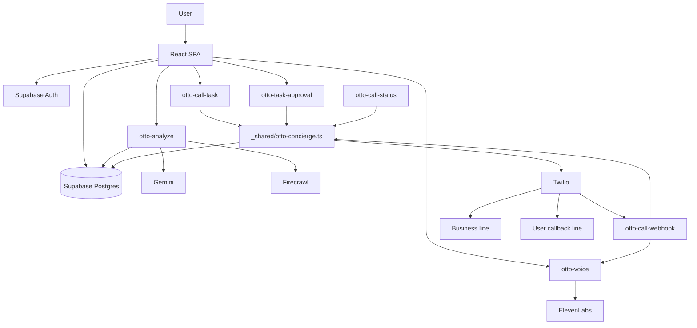

# Otto -An AI concierge leveraging Firecrawl for real-time web research and evidence gathering, plus ElevenLabs for natural voice replies, live call prompts, and callback briefings.

<p align="center">
  
</p>

Otto is a cloud-run AI concierge built around two core production systems:

- `Firecrawl` for fresh web retrieval, evidence capture, and business-target discovery
- `ElevenLabs` for every spoken Otto voice experience in the app and on the phone

Gemini is the orchestration layer. Supabase is the product backend. Twilio is the telephony bridge.

The result is a mobile-first assistant that can:

- answer quick conversational turns directly
- research the web when fresh information is needed
- propose a live verification or booking call
- place that call from the cloud
- call the user back with a spoken briefing

## Product Model

Otto is not a generic chatbot bolted onto a phone system.

The live architecture has a strict division of responsibility:

- `Gemini` decides what the user is asking, whether retrieval is needed, and how to synthesize the answer
- `Firecrawl` provides the real-world evidence when Otto needs current web information
- `ElevenLabs` generates the actual Otto voice for browser replies, business-call prompts, and callback briefings
- `Twilio` delivers the phone call and webhook lifecycle
- `Supabase` stores auth, profiles, tasks, steps, approvals, logs, and edge functions

That separation matters. The app is designed so conversational turns do not pay the cost of web retrieval, while real verification or booking flows still have retrieval-backed evidence when needed.

## Core Experience

### 1. Conversational turns

For lightweight input like:

- `hi`
- `hello`
- `thanks`
- `okay`
- short follow-ups that do not need live information

Otto stays on the Gemini path and replies immediately without invoking Firecrawl.

### 2. Retrieval-backed answers

When the user asks for something current or externally verifiable, Otto escalates to Firecrawl and returns:

- a synthesized answer
- supporting sources
- structured follow-ups
- optionally a live call proposal if phone verification would improve confidence

### 3. Cloud phone workflows

When a live call is useful, Otto can:

- create a call task
- call the business from the cloud
- speak through ElevenLabs audio
- listen for spoken answers
- summarize the result
- call the user back with a spoken briefing

## Architecture



## Why Firecrawl Matters

Firecrawl is the retrieval layer of record in this project.

Otto uses Firecrawl when it needs fresh, external, reviewable evidence. That includes:

- current business details
- location-specific answers
- phone or website discovery
- booking and verification context
- evidence snapshots stored alongside tasks

### Firecrawl responsibilities

- search the web for relevant current results
- return page content Otto can synthesize against
- provide URLs, snippets, and evidence for the UI
- justify live call proposals with source-backed context
- persist source snapshots on task records for later review

### Firecrawl rules in this repo

- Firecrawl is the only backend retrieval/search integration
- Firecrawl is not used for lightweight conversational turns
- call proposals should be grounded in plausible external evidence when the request depends on real-world data
- source snapshots are persisted so the user can inspect what Otto relied on

### Firecrawl entry point

- [`supabase/functions/otto-analyze/index.ts`](./supabase/functions/otto-analyze/index.ts)

This is where:

- Gemini interprets the request
- retrieval need is classified
- Firecrawl queries are built and executed
- Firecrawl evidence is normalized into user-facing and task-facing structures

## Why ElevenLabs Matters

ElevenLabs is the voice layer for Otto.

It is not just a browser nicety. It is the single TTS pipeline across:

- in-app assistant replies
- business-call speech prompts
- callback briefing speech

That gives Otto one consistent voice system instead of fragmented browser speech in one place and telephony speech in another.

### ElevenLabs responsibilities

- generate MP3 audio for in-app Otto replies
- generate audio for Twilio-hosted business call prompts
- generate the spoken callback script after a task finishes
- keep the app and phone workflow aligned on one voice stack

### Voice modes

The live voice function supports:

- `app`
- `call`
- `callback`

### ElevenLabs entry point

- [`supabase/functions/otto-voice/index.ts`](./supabase/functions/otto-voice/index.ts)

### Frontend voice entry point

- [`src/features/otto/api/fetchOttoVoice.ts`](./src/features/otto/api/fetchOttoVoice.ts)

## Request Lifecycle

### In-app answer lifecycle

1. User submits text, voice, and optionally a camera frame.
2. The frontend calls `otto-analyze`.
3. Otto authenticates the session and loads the user profile.
4. Gemini classifies the turn.
5. If retrieval is needed, Firecrawl runs.
6. Gemini synthesizes the reply from profile context, session context, and Firecrawl evidence.
7. The UI renders the reply, sources, and any call proposal.
8. The frontend requests `otto-voice` and plays the ElevenLabs reply.

### Call-task lifecycle

1. User approves a call proposal.
2. The frontend calls `otto-call-task`.
3. A task row and ordered step rows are inserted.
4. `_shared/otto-concierge.ts` begins executing the task chain.
5. Twilio places the business call.
6. `otto-call-webhook` serves TwiML and processes speech turns.
7. Gemini decides whether to continue asking, complete, or fail the business leg.
8. The task is updated in Supabase.
9. Otto waits briefly, then Twilio places the callback briefing.
10. ElevenLabs generates the spoken callback audio.

## Supabase Functions

### `otto-analyze`

Purpose:

- authenticated turn orchestration
- Gemini interpretation and answer synthesis
- Firecrawl retrieval and source normalization
- call proposal generation

Path:

- [`supabase/functions/otto-analyze/index.ts`](./supabase/functions/otto-analyze/index.ts)

### `otto-voice`

Purpose:

- ElevenLabs TTS gateway for app, call, and callback audio

Path:

- [`supabase/functions/otto-voice/index.ts`](./supabase/functions/otto-voice/index.ts)

### `otto-call-task`

Purpose:

- create the live cloud-call task
- insert ordered steps
- start execution

Path:

- [`supabase/functions/otto-call-task/index.ts`](./supabase/functions/otto-call-task/index.ts)

### `otto-call-webhook`

Purpose:

- receive Twilio webhooks
- play ElevenLabs prompts
- gather speech
- update call state
- trigger callback progression

Path:

- [`supabase/functions/otto-call-webhook/index.ts`](./supabase/functions/otto-call-webhook/index.ts)

### `otto-task-approval`

Purpose:

- resolve user approval state for queued steps

Path:

- [`supabase/functions/otto-task-approval/index.ts`](./supabase/functions/otto-task-approval/index.ts)

### `otto-call-status`

Purpose:

- inspect Twilio call status for a task during live verification and debugging

Path:

- [`supabase/functions/otto-call-status/index.ts`](./supabase/functions/otto-call-status/index.ts)

### Shared call runtime

Path:

- [`supabase/functions/_shared/otto-concierge.ts`](./supabase/functions/_shared/otto-concierge.ts)

This file contains the core cloud-call engine:

- auth helpers
- profile loading
- task fetching
- Twilio call creation
- callback delay handling
- task-chain execution
- conversation-log persistence

## Frontend Structure

The frontend is intentionally split by product surface.

### App shell

- [`src/app/App.tsx`](./src/app/App.tsx)

Handles:

- session bootstrap
- invalid-session recovery
- auth and onboarding gating
- tab navigation
- fixed-layout behavior for the Otto screen

### Otto experience

- [`src/features/otto/screens/OttoPage.tsx`](./src/features/otto/screens/OttoPage.tsx)

Handles:

- chat UI
- input submission
- mic flow
- camera flow
- voice playback
- call approval entry

Related Otto files:

- [`src/features/otto/api/submitOttoTurn.ts`](./src/features/otto/api/submitOttoTurn.ts)
- [`src/features/otto/api/fetchOttoVoice.ts`](./src/features/otto/api/fetchOttoVoice.ts)
- [`src/features/otto/api/approveOttoTask.ts`](./src/features/otto/api/approveOttoTask.ts)
- [`src/features/otto/hooks/useSpeechRecognition.ts`](./src/features/otto/hooks/useSpeechRecognition.ts)
- [`src/features/otto/components/CallApprovalSheet.tsx`](./src/features/otto/components/CallApprovalSheet.tsx)

### Tasks and approvals

- [`src/features/tasks/components/TaskHistoryPanel.tsx`](./src/features/tasks/components/TaskHistoryPanel.tsx)
- [`src/features/tasks/api/fetchInboxTasks.ts`](./src/features/tasks/api/fetchInboxTasks.ts)
- [`src/features/tasks/api/resolveTaskApproval.ts`](./src/features/tasks/api/resolveTaskApproval.ts)

### Account and onboarding

- [`src/features/account/components/AccountPanel.tsx`](./src/features/account/components/AccountPanel.tsx)
- [`src/features/account/components/ProfileForm.tsx`](./src/features/account/components/ProfileForm.tsx)
- [`src/features/account/profile.ts`](./src/features/account/profile.ts)

### Shared Supabase client and types

- [`src/shared/supabase/client.ts`](./src/shared/supabase/client.ts)
- [`src/shared/supabase/types.ts`](./src/shared/supabase/types.ts)

## Data Model

### `profiles`

Stores:

- user identity-adjacent profile data
- callback phone
- onboarding completion state
- location/language defaults

### `otto_tasks`

Stores:

- top-level task status
- business target info
- request query
- result summary
- source snapshot
- conversation log
- Twilio SIDs

### `otto_task_steps`

Stores ordered units of work.

The live flow primarily uses:

- `call_business`
- `callback_user`

### `otto_task_approvals`

Stores:

- pending approvals
- approved/declined actions
- resolution timestamps

## Environment

### Frontend env

- `VITE_SUPABASE_URL`
- `VITE_SUPABASE_PUBLISHABLE_KEY`

### Supabase function secrets

- `SUPABASE_URL`
- `SUPABASE_ANON_KEY`
- `SUPABASE_SERVICE_ROLE_KEY`
- `GEMINI_API_KEY`
- `GEMINI_MODEL`
- `FIRECRAWL_API_KEY`
- `ELEVENLABS_API_KEY`
- `ELEVENLABS_MODEL_ID`
- `ELEVENLABS_APP_VOICE_ID`
- `ELEVENLABS_CALL_VOICE_ID`
- `ELEVENLABS_CALLBACK_VOICE_ID`
- `TWILIO_ACCOUNT_SID`
- `TWILIO_AUTH_TOKEN`
- `TWILIO_PHONE_NUMBER`
- `OTTO_WEBHOOK_SECRET`
- `OTTO_CALLBACK_DELAY_MS`

## Database Migrations

Apply these in order on the linked Supabase project:

- `supabase/migrations/202603210001_phase4_cloud_agent.sql`
- `supabase/migrations/202603210002_concierge_inbox_email.sql`
- `supabase/migrations/202603210003_callback_step_phase6.sql`
- `supabase/migrations/202603210004_remove_email_integration.sql`

## Local Development

Install dependencies:

```bash
npm install
```

Run the app:

```bash
npm run dev
```

## Validation

Type-check:

```bash
npx tsc --noEmit -p tsconfig.app.json
npx tsc --noEmit -p tsconfig.node.json
```

Standard scripts:

```bash
npm run lint
npm run build
npm test
```

Supabase functions:

```bash
supabase functions deploy otto-analyze --no-verify-jwt --project-ref <project-ref>
supabase functions deploy otto-voice --no-verify-jwt --project-ref <project-ref>
supabase functions deploy otto-call-task --no-verify-jwt --project-ref <project-ref>
supabase functions deploy otto-call-webhook --no-verify-jwt --project-ref <project-ref>
supabase functions deploy otto-task-approval --no-verify-jwt --project-ref <project-ref>
supabase functions deploy otto-call-status --no-verify-jwt --project-ref <project-ref>
```

## Operational Notes

- callback phone is required for cloud-call flows
- conversational turns should stay on Gemini when retrieval is unnecessary
- Firecrawl evidence is persisted with tasks so call decisions are reviewable
- ElevenLabs is the intended voice path; browser speech is only a fallback when the app path fails
- the callback leg currently supports a configurable delay through `OTTO_CALLBACK_DELAY_MS`
- using the same number as both business line and callback target can still produce busy outcomes depending on carrier timing

## Current Live Focus

If you are changing this system, keep these priorities intact:

1. Firecrawl remains the sole retrieval and evidence layer.
2. ElevenLabs remains the shared voice pipeline across app and telephony.
3. Gemini handles orchestration, not arbitrary side systems.
4. Supabase task state must stay canonical and inspectable.
5. Twilio webhooks must stay public and reliable for the cloud-call flow to work.
